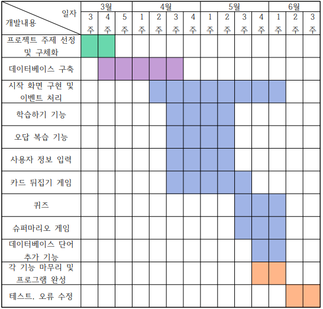

# English-learning-program

__초등학생을 위한 영어 단어 학습 프로그램__
## 주요기능
1. 학습하기   
  영어 단어를 보면서 뜻을 생각하도록 하는 '학습' 단계와, 영어 단어를 그림과 매칭하는 '단어카드' 단계, 공부한 단어를 확인해볼 수 있는 '테스트' 단계로 구성

2. 복습하기   
  '테스트' 단계에서 틀린 단어를 모아서 복습할 수 있는 '복습' 단계로 구성

3. 미니 게임   
  카드를 뒤집어서 영어 단어와 뜻을 매칭하는 '카드 뒤집기 게임'과 캐릭터를 움직여서 연필을 획득하면 그림과 영어 단어를 매칭할 수 있도록 하는 '그림 맞추기 게임(슈퍼마리오 게임)' 으로 구성

## 기대효과
> 비대면으로 인해 집에서 공부할 시간이 많아진 초등학생을 위해, 효과적으로 재미있게 영어를 공부할 수 있는 프로그램을 제작하였다. 학습 단계에서 단어와 뜻, 단어와 그림을 매칭하면서 공부할 수 있어서 기억에 더 잘 남도록 하였다. 또한 학습에서 익힌 단어를 게임을 통해 복습할 수 있도록 하였다. 게임도 2가지로 구성하여 단어와 뜻을 매칭하는 게임, 단어와 그림을 매칭하는 게임으로 구성하였다.     

## 개발일정   
</img>
