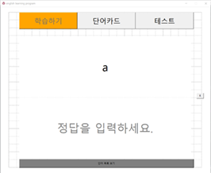
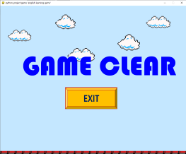

# English-learning-program

### Motivation :
초등학생을 대상으로 영어 단어를 효율적이면서 빠르게 외울 수 있는 영어 단어 암기 프로그램이다. 
이는 영어 단어를 공부하고자 하는 모든 연령대의 사람들이 이용할 수 있는 프로그램이지만, 기본적으로 
초등학생을 그 대상으로 한다. 특히 요즘은 코로나로 인하여 집에서 비대면으로 수업을 듣는 학생들이 많아 
학생들 간의 학습 격차가 벌어지고, 사교육의 힘을 빌려야 수업에 따라갈 수 있는 악순환이 반복되고 있다.
따라서 집에서도 효과적으로 영어를 학습할 수 있는 프로그램을 개발하여 학생들의 교육에 도움이 되고자 한다.

### Main Functions :
1. [**Learning Stage**](https://github.com/Ohjiwoo-lab/english-learning-program#1-Learning-Stage)
2. [**Test**](https://github.com/Ohjiwoo-lab/english-learning-program#2-Test)
3. [**Review Stage**](https://github.com/Ohjiwoo-lab/english-learning-program#3-Review-Stage)
4. [**Card Flipping Game**](https://github.com/Ohjiwoo-lab/english-learning-program#4-Card-Flipping-Game)
5. [**Picture Matching Game**](https://github.com/Ohjiwoo-lab/english-learning-program#5-Picture-Matching-Game)
  
### 1. Learning Stage
Learning Stage는 영어 단어를 보면서 뜻을 생각하도록 하는 '학습' 단계와, 영어 단어를 관련된 그림과 매칭하는 
'단어카드' 단계로 구성되어 있다. '학습' 단계에서는 상단에 영어 단어가 나오고 해당 단어의 뜻을 하단에 입력할 수 있다.
앞 뒤로 자유롭게 이동할 수 있지만, 해당 단어의 정확한 뜻을 입력하였을 때만 상태가 맞았음을 의미하는 'O'로 바뀐다.
단어의 정답 상태는 '단어 목록 보기'를 통해 확인할 수 있다.
'단어 카드' 단계에서는 상단에 그림이 나오고, 하단에 해당 그림과 연관된 영어 단어와 뜻이 나온다.
이 역시 앞뒤로 자유롭게 이동할 수 있다. 그림과 단어를 매칭함으로써 더 기억에 잘 남을 수 있도록 하였다.   

**Menu Page**   
</img>
</img>   

**학습 단계**   
</img>
</img>
</img>   

**단어 카드 단계**   
</img>   

### 2. Test
Test에서는 '학습' 단계와 '단어 카드' 단계를 통해 학습한 단어를 퀴즈를 통해 확인할 수 있다.
화면에 영어 단어와 한글 단어가 랜덤하게 나오는데, 회색 박스에 알맞은 단어를 입력하면 된다.
영어 단어에는 해당하는 뜻을, 한글 단어에는 해당하는 영어 단어를 입력한다. 모두 입력한 뒤에 Submit 버튼을
통해 제출하면 단어들의 정답 유무를 확인할 수 있다. 자신이 어떤 단어를 모르는 지 확인해볼 수 있다.   

</img>
</img>
</img>   

### 3. Review Stage
Review Stage에서는 '테스트' 단계에서 틀렸던 단어들을 한 번에 복습할 수 있다. 따라서 테스트를 진행하지
않으면 '복습' 단계를 시도할 수 없다. 화면 레이아웃은 '학습' 단계에서와 동일하다. 상단에 테스트에서 틀렸던 
영어 단어가 나오면 하단에 해당 단어의 뜻을 입력하면 된다. 하지만 '학습' 단계에서와 다른 점은, 앞 뒤로 자유롭게
이동할 수 없다는 점이다. 반드시 단어의 뜻을 입력해야만 다음 단어로 넘어갈 수 있고, 단어의 정답유무도 모든 단어를 
다 복습한 뒤에야 확인가능하다. 
만약 테스트에서 5개의 단어를 틀렸다면, '복습' 단계에 5개의 단어가 등장하는데 이 단어의 뜻을 모두 입력해야 결과 창이 
나타난다. 또다시 단어의 뜻을 잘못 입력했다면, 그 단어는 다음 복습에도 등장한다. 맞춘 단어는 다음 복습에 등장하지 않는다.   

</img>
</img>
</img>   

### 4.Card Flipping Game
이 프로그램에 존재하는 2가지 미니게임 가운데 하나이다. 이는 '학습' 단계로부터 모티브를 받은 게임으로, 영어 단어와
뜻을 카드를 뒤집는 행위를 통해 매칭하는 것이다. 3개의 단계로 이루어져있고, 각 단계마다 제한 시간과 카드의 개수가 다르다.
제한 시간은 3분, 4분, 5분이며, 카드의 개수는 12개, 20개, 30개이다. 카드를 클릭하면 뒤집어지면서 글자가 나타나고
이를 최대한 기억하면서 게임을 진행하는 것이 중요하다. 제한시간을 초과하면 게임에 실패한다.   

**Game Progress**   
</img>
</img>
</img>   

**Success/Fail**   
게임에 성공했을 때와 실패했을 때의 화면 구성이다.   
</img>
</img>   

### 5. Picture Matching Game
이는 '단어 카드' 단계로부터 모티브를 받은 게임으로, 그림과 영어 단어를 캐릭터를 움직이는 행위를 통해 매칭하는 것이다.
캐릭터를 방향키와 스페이스바를 통해 조작을 하여 지형을 따라 이동하면서, 연필을 획득하면 문제가 등장한다. 문제는 
왼쪽에 그림, 오른쪽에 선택지가 있어서 올바른 선택지를 고르는 형식이다. 화면의 왼쪽 상단에는 현재 남아있는 목숨의 개수가 
표시되는데, 총 3개의 목숨을 모두 잃으면 게임에 실패한다. 
목숨은 다음의 2가지 경우에 잃게 된다.
- 문제가 등장하는 시점부터 제한 시간 5초를 초과하였을 때
- 문제의 잘못된 선택지를 골랐을 때

화면에 있는 모든 연필을 획득하여 문제를 풀면, 다음 Stage로 넘어갈 수 있는 문이 생성된다. 이 문을 통해 Stage를 이동할 수 있고,
모든 Stage를 목숨 3개를 유지한 채, 통과하면 게임에 성공한다. 현재 Stage는 2개이다.   

**Game Progress**   
</img>
</img>
</img>   

**Correct/Wrong**   
문제를 맞췄을 때와 틀렸을 때의 화면 구성이고, 다음 Stage로 넘어갈 수 있는 문이 생성된 모습이다.   
</img>
</img>
</img>   

**Success/Fail**   
게임에 성공했을 때와 실패했을 때의 화면 구성이다.   
</img>
</img>   

### DataBase : 
데이터베이스를 구축하여, User 정보와 Word 정보를 저장하였다. User 정보를 통해 '로그인' 기능을 구현하였고, Word 정보를 통해
영어 단어의 뜻과 그림을 함께 관리하였다.   

</img>
</img>   

### Development Schedule :   
</img>
